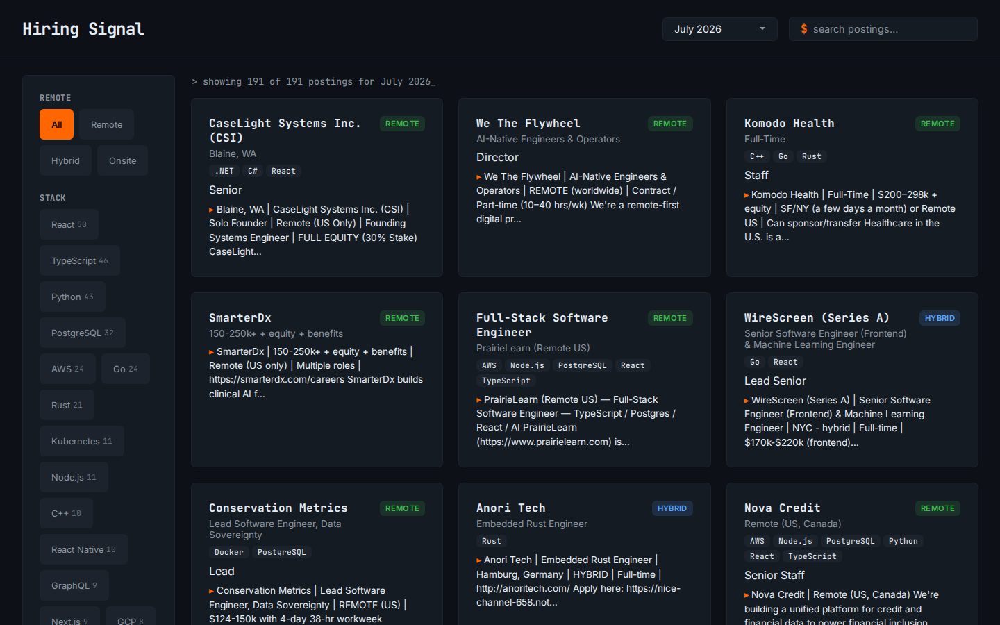
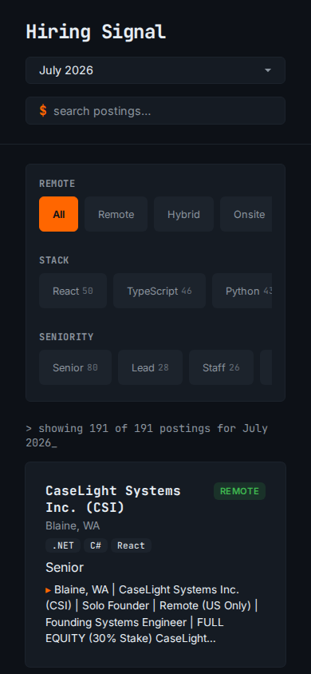

# Grepwork

**▶ Live demo — [apps.charliekrug.com/hiring-signal](https://apps.charliekrug.com/hiring-signal/)**

The HN "Who is hiring?" thread, finally searchable.

[](https://github.com/ctkrug/hiring-signal/actions/workflows/ci.yml)
[](LICENSE)

Every month, hundreds of companies post job listings as comments on a single Hacker News
["Who is hiring?"](https://news.ycombinator.com/submitted?id=whoishiring) thread. It is a great
source of engineering work (remote-friendly, no recruiter spam, an audience that is squarely
developers), but the thread itself is a flat wall of unstructured text with no search, no filters,
and no way to tell what is remote, what stack it uses, or what seniority it targets without reading
every comment.

Grepwork fetches the six most recent threads via HN's public Algolia Search API, runs a lightweight
extraction pass over each top-level comment to pull out structured facets (company, location,
remote type, tech stack, seniority), and serves the result as a fast static board you can search
and filter.





## Who it is for

Developers who job-hunt through HN's monthly "Who is hiring?" thread and are tired of Ctrl-F over a
few hundred comments to find the handful that use their stack and hire remotely.

## Features

- **Search** across every parsed posting (company, location, and full body), debounced so it stays
  responsive as you type.
- **Filter by remote type** (remote, hybrid, onsite) as a single choice, with an explicit "no
  remote" post correctly classed as onsite rather than remote.
- **Filter by stack and seniority** as multi-select chips, ranked by how often each tag actually
  appears in the active month so the useful ones sit first.
- **Browse the archive**, not just the latest thread, via the month picker.
- **Read the source post** by expanding any card to its full original comment text.
- **Honest extraction**: posts that do not follow the usual `Company | Location` opening are flagged
  so an auto-guessed company or location is never presented as fact.

## Why it is interesting

It is real (if lightweight) extraction over messy, inconsistent, human-written text. No two
companies format their post the same way, so the parser has to be resilient to a wide range of
phrasing rather than reading one known schema. That is a meaningfully different problem than a CRUD
job board over structured data, and the whole thing ships as a static bundle with no backend.

## Development

```sh
npm install
npm run build-data   # fetch + parse the archive into public/data/ (needed for dev)
npm run dev          # vite dev server at localhost:5173
npm test             # vitest: src/lib unit tests + a jsdom integration suite for main.ts
npm run build        # type-check, refresh public/data/, and build dist/
```

The build is fully static. `scripts/build-data.ts` fetches and parses threads at build time, so
`dist/` ships with zero runtime dependency on the Algolia API and works from any subpath (asset and
data paths are all relative). See [`docs/ARCHITECTURE.md`](docs/ARCHITECTURE.md) for how the pieces
fit together and [`docs/DESIGN.md`](docs/DESIGN.md) for the visual direction.

## Stack

TypeScript throughout, Vite for the static build, Vitest for the tests. The unit tests cover the
highest-value logic (extraction and filtering correctness); a jsdom-backed suite covers the DOM
wiring in `main.ts`. There is no backend: the site is a static bundle that fetches and parses at
build time and ships as plain HTML, CSS, and JS.

See [`docs/VISION.md`](docs/VISION.md) for the full rationale and
[`docs/BACKLOG.md`](docs/BACKLOG.md) for the build plan.

## License

MIT, see [LICENSE](LICENSE).

More of Charlie's projects → https://apps.charliekrug.com
</content>
</invoke>
